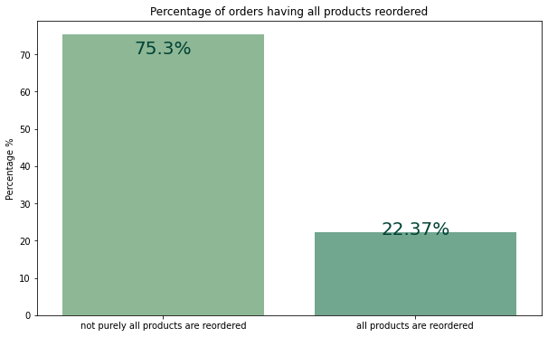
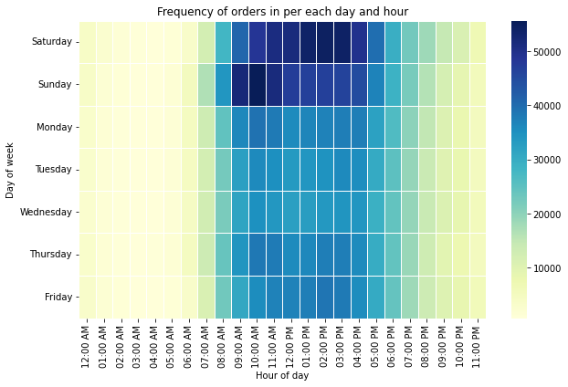
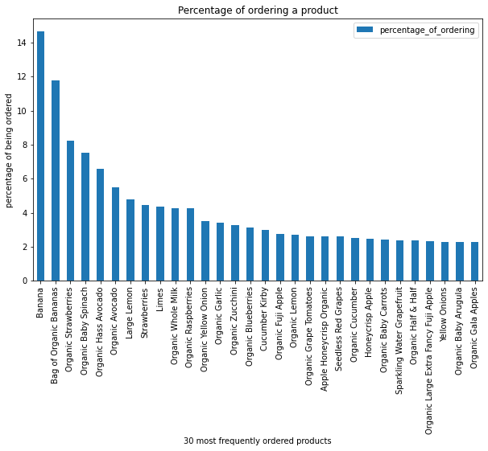
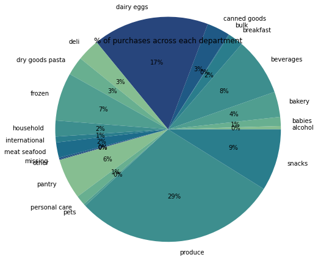
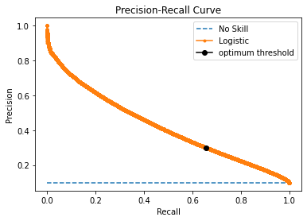

# Instacart-Market-Basket-Analysis :shopping_cart:
<div align="center">

</div>

## Project Description 
- This project exploits the power of
data analysis and machine learning
to take business to the next level!
- It's one of the competiting projects in [Data Science - Challenge Round 2 Hosted by Dr. Doaa Mahmoud](https://www.linkedin.com/posts/doaa-mahmoud-abdel-aty-01b25b144_datascience-machinelearning-data-activity-6919216035816517632-R9Fl/?utm_source=linkedin_share&utm_medium=member_desktop_web). 
- The project consist of 3 sections
    - EDA and Interactive Dashboard by Power BI
    - Predictive Analysis Model
    - Association Rules

## Open directly from kaggle Notebooks!
- [EDA on instacart data](https://www.kaggle.com/code/nouranhany10/eda-on-instacart-data)
- [Next Order Recommender](https://www.kaggle.com/code/tokakhaled/insta-market-analysis/)

## EDA and Interactive Dashboard by Power BI :bar_chart:
- General Analysis.
- Analyzing Behavour of users: users who always order same products.
- How Time affects the purchasing behaviour of customers?
- Analyzing products
- Analyzing Organic Prodcuts.
- Purchasing behaviour on Departments and Aisles.
<table align="center">
  <tr>
    <td align="center">
      
    <br />
    </td>
    <td align="center">
    
    <br />
    </td>
  </tr>
 </table>
 <table align="center">
  <tr>
    <td align="center">
      
    <br />
    </td>
    <td align="center">
    
    <br />
    </td>
    
  </tr>
 </table>
    
## Next Order Recommender/Predictor :bread: :fries: :doughnut:
**A predictive analysis model** , that predicts the products ordered in users' future order based on each purchasing history. Primary Key is the user-product pair to predict whether will be in the future order or not.

> XGBoost Classifier was used.

> Features with highest importance used by the model:
> - up_orders_since_last_order: measures how long the user hasn't considered buying a specific product.
> - up_order_rate_since_first_time: measures the degree a user like a product. It's the ratio by which a user will buy a product from the first moment he/she knew about it.
> - prod_reorder_ratio: measures how customers in general like a product.
> - user_reorder_ratio: measures how this user is likely to buy something new!


## Association Rules :banana: :arrow_right: :tomato:


## Project Challenges :scream_cat:
### Next Order Recommender
> * Data is sparse, we have very large number of products and of course the customer will have very few in his/her next order. Data is very skewed to the negative class. Class distribution: 90% negative class, 10% positive class. 
> * First, we've found that there's alot of false negatives, do We changed the threshold to maximize the recall, while keeping the precision above a certain threshold [0.3]. 
> * In ther words, we wanted to reduce, the false negatives, the number of products the model say user won't predict in the future while he/she will actually does. On the other side, it's okay to allow some false positives, when the model recommends a products the user will less likely buy in his/her next order.



## Project Organization
```
./
├── EDA
|     ├── eda-on-instacart-data.ipynb 
|         
├── Model
|     |                                              
|     └── predictive-analysis-model.ipynb 
└── Business Insights 
      ├── Business Questions-Solutions.pdf                                              
      └── Project-Data Description.pdf
```
## Todos
- [ ] Applying dynamic thresholding on user's products according to his/her average basket size.
- [ ] Applying seperate prediction on strong behaviour users.
- [ ] Deploy the Model.

## Contributors
<table align="center">
  <tr>
    <td align="center">
    <a href="https://github.com/tokakhaled" target="_black">
    
    <br />
    <sub><b>Toka Khaled</b></sub></a>
    </td>
    <td align="center">
    <a href="https://github.com/NouranHany" target="_black">
    
    <br />
    <sub><b>Noran Hany</b></sub></a>
    </td>
  </tr>
 </table>
